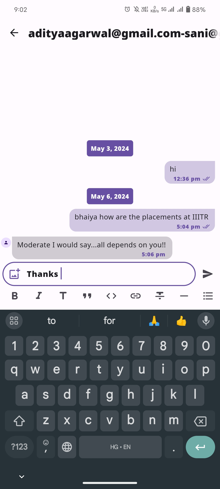

# Naukrified- Elevating Careers, Empowering Intelligence

## About Naukrified

Naukrified is an application designed to revolutionize the job search process by streamlining it and empowering users with intelligent features. It is built using a versatile technology stack including Flutter, Firebase, Flask, Python, NLP, and Dart. This comprehensive platform provides various functionalities such as job search, resume building, job posting, job application, job recommendations based on NLP techniques, trends analysis, career insights, and more.

## Why This Technology Stack

- **Cross-platform Development**: Flutter allows development of a single codebase for both Android and iOS platforms, reducing development time and effort.
- **Real-time Communication**: Firebase provides real-time database and messaging services, enabling seamless communication between users and instant updates of job postings and chat messages.
- **Scalability**: Firebase's scalable infrastructure ensures that the application can handle a large number of users and data without compromising performance.
- **Flexibility**: Flask and Python offer flexibility in backend development, allowing implementation of custom logic and integration of third-party libraries for advanced functionalities.
- **Advanced Features**: NLP techniques implemented in Python enhance the application’s capabilities by providing personalized job recommendations.

## Tools

- Flutter
- Dart
- Firebase
- Python
- Flask
- NLP
- AI/ML

## Key Features

1. **Authentication**: Secure authentication system to ensure user data safety and privacy.
2. **Resume Building**: A user-friendly interface for creating and customizing professional resumes & templates.
3. **Job Posting and Application**: Easy job posting and job application process for job seekers and recruiters.
4. **Job Recommendation Using NLP**: Utilization of Natural Language Processing (NLP) techniques for personalized job recommendations based on user and job dataset.
5. **Trends Analysis and Insights**: Analysis of job market trends, insights into career and growth opportunities.
6. **Chat Feature**: Real-time chat functionality for job seekers to communicate with recruiters or other users.
7. **Chatbot (under development)**: Intelligent chatbot assistance for users, providing career advice.

## Setting Up

### Flutter Setup

1. Install Flutter SDK from [here](https://flutter.dev/docs/get-started/install).
2. Set up your preferred IDE for Flutter development (Android Studio, Visual Studio Code, etc.).
3. Verify your Flutter installation by running `flutter doctor` in your terminal.

### Firebase Setup

1. Create a Firebase project from the [Firebase Console](https://console.firebase.google.com/).
2. Add your Android and iOS apps to the Firebase project(Note: Firebase API and sensitive information is removed, thus you have to add your own firebase project,else, you can download the apk).
3. Follow the Firebase setup instructions provided for each platform.

### Cloning the Repository

1. Clone the repository using `git clone https://github.com/SanidhayaSharma141/Naukrified`.
2. Navigate to the project directory: `cd Naukrified`.

### Additional Steps

- For Flask backend setup, ensure Python and Flask are installed on your system. You may need to set up a virtual environment for Flask.
- For NLP features, ensure the required Python libraries are installed. You can install them using pip.

## Snapshots

## Contributing

We welcome contributions to Naukrified! Feel free to open issues, submit pull requests, or contact us for any inquiries.

